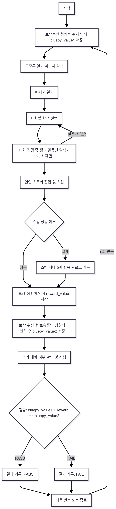

# Blue Archive - PC 모모톡 보상 자동화 테스트

블루 아카이브의 스팀(PC) 버전에서, 모모톡 대화를 통해 청휘석 보상을 자동으로 수령하고, OCR을 통해 기존 청휘석 보유량, 보상 청휘석, 현재 청휘석 보유량을 추출하고 정상 증가했는지 검증하는 Python 기반의 자동화 테스트입니다.

---
### 📌 테스트 시나리오 흐름도



---

## 📌 주요 기능

- 💬 **모모톡 자동 진입 및 대화 선택**
- 🎁 **청휘석 보상 수령 루틴 완전 자동화**
- 🔍 **OCR 기반으로 수령 전/후 보유중인 청휘석 수량 비교**
- 💬 **테스트 로그 및 결과 txt 파일로 기록**
---

## 🚀 사용 기술

- `Python 3.x`
- `PyAutoGUI` / `OpenCV` : UI 이미지 인식 및 클릭 자동화
- `pytesseract` : 숫자 인식을 위한 OCR

---

## 🖥️ 실행 방법

```bash
python reward.py
```

> 📁 `test_results.txt`, `config.toml`, 이미지 리소스들이 동일 디렉토리에 있어야 합니다.

---

## 📺 시연 영상

- [모모톡 자동 진행 및 보상 정상 수령 테스트 시연](https://youtu.be/3f4nmQiDG7k)  

---

👉 [테스트 설계 및 결과 보기 (Google Sheet)](https://docs.google.com/spreadsheets/d/1RJwQvNWn9rVNjy3hYpxLwXlS4RYEvjnUWjgHTlPDYW8/edit?usp=sharing)

---

## 📂 디렉토리 구조 예시

```
blue_archive_momo_reward/
├── reward.py              # 보상 수령 자동화 스크립트
├── config.toml            # 테스트 설정 파일
├── test_log.txt           # 실행 로그
├── test_results.txt       #테스트 결과 저장 (보상 수량 대로 청휘석 오르면 PASS)
├── images/                # 테스트 루틴에 사용되는 이미지 리소스
│   ├── momo_button.png
│   ├── momo_target.png
│   ├── ...
├── digit_templates/       # 보유중인 청휘석 숫자를 읽기 위한 숫자 이미지 리소스
│   ├── 0.png
│   ├── 1.png
│   ├── ...
├── digit_templates2/     # 수령한 보상 청휘석 숫자를 읽기 위한 숫자 이미지 리소스, 보상은 20,40,60,80,100,120만 있으므로 0,1,2,4,6,8만 필요, 나머지는 더미
│   ├── 0.png
│   ├── 1.png
│   ├── ...
├── flowchart/             #전체 테스트 흐름도 저장 폴더

```

---

## 🙋‍♂️ 기타

- 본 테스트는 인연 스토리 이후 대화가 이어지는 등 다양한 상황에서도 테스트가 정상 진행되도록 방어 로직을 구현했습니다.
- 반복 테스트 로직을 구현했습니다.

